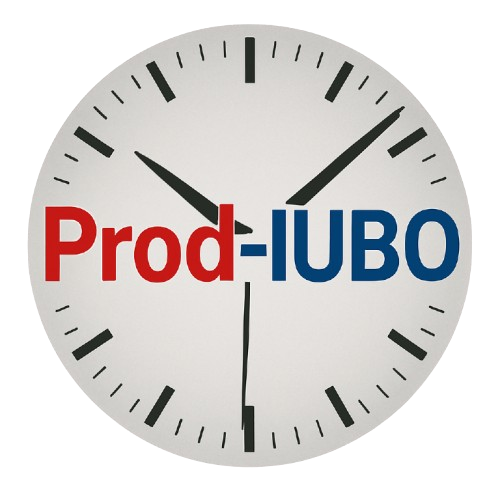

# Prod-UIBO: Reloj de Productividad Inteligente

 Prod-UIBO es una aplicación web diseñada para ayudarte a maximizar tu productividad y gestionar tu tiempo de manera eficaz. Ofrece un temporizador de cuenta regresiva altamente personalizable con una interfaz limpia, moderna y enfocada en el usuario.

## ✨ Características Principales

* **Temporizador Personalizable:** Configura el reloj para cualquier duración, desde minutos hasta 72 horas.
* **Visualización Clara:** Muestra el tiempo restante en formato `HH:MM:SS` de forma prominente.
* **Presets de Tiempo Rápido:** Botones para iniciar rápidamente sesiones de productividad de 20, 30, 45 o 60 minutos.
* **Entrada de Tiempo Detallada:**
    * Permite ingresar horas (hasta 72) y minutos (hasta 59) de forma manual.
    * Validación integrada para asegurar que los tiempos ingresados sean correctos.
* **Controles Completos del Temporizador:**
    * Iniciar
    * Pausar / Reanudar
    * Reiniciar (al último tiempo configurado)
    * Detener (resetea el temporizador a cero)
* **Diseño Responsivo:** Interfaz adaptable que funciona de manera óptima en computadoras de escritorio, tabletas y dispositivos móviles.
* **Tema Oscuro Elegante:** Paleta de colores oscuros (negro, grises y blanco) para una menor fatiga visual y un aspecto moderno, con toques de color en la marca (rojo y azul para "Prod-UIBO").
* **Animación Dinámica:** Los segundos cambian de forma fluida y visualmente agradable.
* **Identidad de Marca:** Nombre del proyecto "Prod-UIBO" visible en la interfaz.
* **Optimización SEO Básica:** Metadata y favicon configurados para una mejor indexación y reconocimiento.

## 🚀 Tecnologías Utilizadas

* **Next.js (v13+ con App Router):** Framework de React para aplicaciones web modernas y optimizadas.
* **React (v18+):** Biblioteca de JavaScript para construir interfaces de usuario.
* **TypeScript:** Superset de JavaScript que añade tipado estático para un desarrollo más robusto.
* **CSS Modules:** Para estilos encapsulados y específicos por componente, evitando colisiones de nombres.
* **HTML5 & CSS3:** Estándares web para la estructura y el diseño.

## 🛠️ Instalación y Puesta en Marcha Local

Sigue estos pasos para tener una copia del proyecto corriendo en tu máquina local para desarrollo y pruebas.

### Prerrequisitos

* Node.js (versión 18.x o superior recomendada)
* npm (usualmente viene con Node.js) o yarn

### Pasos

1.  **Clona el Repositorio:**
    ```bash
    git clone [https://github.com/TU_USUARIO/TU_REPOSITORIO.git](https://github.com/TU_USUARIO/TU_REPOSITORIO.git)
    cd TU_REPOSITORIO
    ```
    *(Reemplaza `TU_USUARIO/TU_REPOSITORIO` con la URL real de tu repositorio en GitHub)*

2.  **Instala las Dependencias:**
    Si usas npm:
    ```bash
    npm install
    ```
    Si usas yarn:
    ```bash
    yarn install
    ```

3.  **Ejecuta el Servidor de Desarrollo:**
    Si usas npm:
    ```bash
    npm run dev
    ```
    Si usas yarn:
    ```bash
    yarn dev
    ```

4.  **Abre la Aplicación:**
    Abre tu navegador web y visita `http://localhost:3000`. Deberías ver la aplicación Prod-UIBO en funcionamiento.

## 📁 Estructura del Proyecto (Simplificada)

El proyecto sigue una estructura organizada para facilitar el mantenimiento y la escalabilidad:
